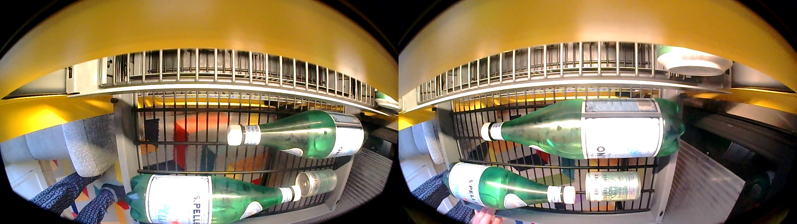

# fridge_view

### Capture an opened rack of a fridge. 
#### The implementation is based on contours detection and can be run with a single CPU.

1. The main module gets the stream from a video capture, which is implemented in 'streaming_utils' module. Then it uses the `rack_detector` to identify a frame containing a fully opened rack.
2. To identify a fully opened rack, the algorithm searches for the frame with the most contours compared to its neighboring frames. The implementation of this technique can be found in the `rack_detection` module.
3. The first part of the assignment, which involves stitching two frames based on timestamps, is implemented in the `utils` module.
